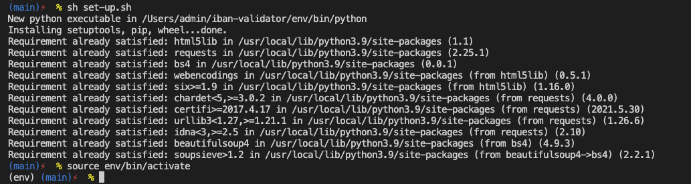
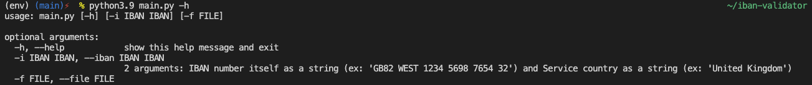
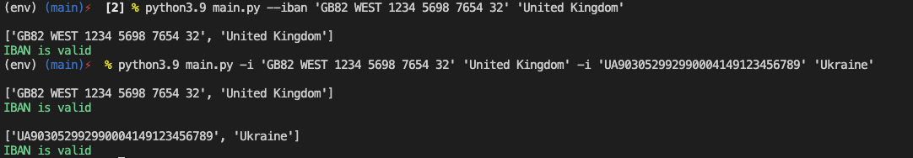
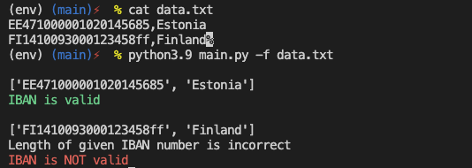
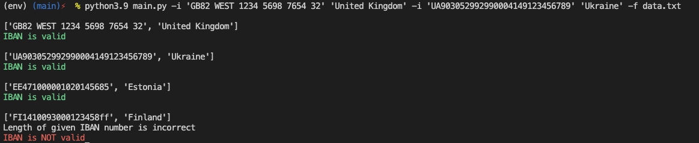
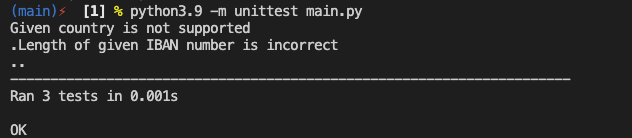

# iban-validator
**OS**: macOS

## Requirements:
- python3.9 (https://www.python.org/downloads/release/python-390/)
- virtualenv (https://pypi.org/project/virtualenv/)

## Set up:
```
$ sh set-up.sh
$ source env/bin/activate
```


## Run and an overview of the program's features:
Run the program inside the virtual environment that was activated in the previous step with `source env/bin/activate`.
To exit virtual environment eventually, run:
```
$ deactivate
```
### 1. Get an up-to-date list of countries supporting IBAN:
The logic implemented in the file `get-iban-countries.py` parsing a web page (https://www.iban.com/structure) - web scraping - namely the table that stores an up-to-date list of countries and saves the necessary data in a file `iban-data.txt`. This data can be updated by running the command (the file will be overwritten):
```
$ python3.9 get-iban-countries.py
```
### 2. Overview of the functionality of the program:
#### To see the available flags and the required list of arguments:
```
$ main.py -h
```

Thus, the list of available flags: `-h`, `-i or --iban`, `-f`.

#### Pass parameters as command line arguments manually (flag -i or --iban):
```
$ python3.9 main.py --iban 'GB82 WEST 1234 5698 7654 32' 'United Kingdom'
```
or
```
$ python3.9 main.py -i 'GB82 WEST 1234 5698 7654 32' 'United Kingdom' -i 'UA903052992990004149123456789' 'Ukraine'
```
where each parameter is a pair of IBAN number (string, must be in quotes) and country (string, must be in quotes). The flag `-i` or `--iban` must precede every next pair.


#### Read data from file (flag -f):
I created a file `data.txt` where I put the data that I want to process using the program. You can create your own file, but the data formatting must be respected:


Flags can be combined (data will be combined accordingly):
```
$ python3.9 main.py -i 'GB82 WEST 1234 5698 7654 32' 'United Kingdom' -i 'UA903052992990004149123456789' 'Ukraine' -f data.txt
```


#### Errors:
Errors can be viewed in `stderr`:
```
$ python3.9 main.py 'GB82 WEST 1234 5698 7654 32' 'Samadfa' > /dev/null
```


## Run unit tests:
```
$ python3.9 -m unittest main.py
```


## TODO:
- ~~implement algorithm(s);~~ [**DONE** - can be optimised, 3d one can be added];
- ~~expand functionality to the list of IBAN's (interface architecture);~~ [**DONE** ];
- ~~unit and/or other tests;~~ [**DONE** ];
- ~~documentation; [**DONE** ];
- ~~installation procedure; [**DONE** ];
- add the ability to use country codes along with full names;
- add more test cases.